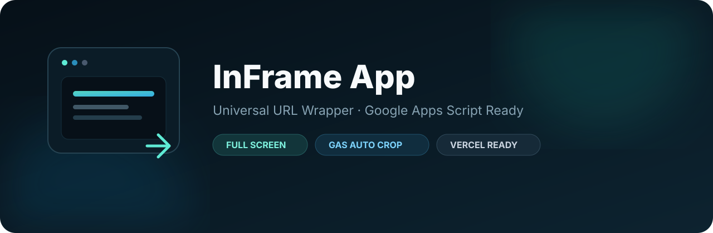

<p align="center">
  
</p>

<p align="center">
  <a href="https://github.com/baska-pro/inframe-app/actions/workflows/ci.yml"></a>
  <a href="https://github.com/baska-pro/inframe-app/actions/workflows/codeql.yml"></a>
  <a href="https://github.com/baska-pro/inframe-app/releases"></a>
  
</p>

# InFrame App

Universal full-screen URL wrapper untuk menampilkan web app di balik URL/domain milik sendiri. Fokus utama proyek ini adalah **Google Apps Script Web App (GAS)**, tetapi dapat digunakan untuk target web lain selama server tujuan mengizinkan embedding melalui iframe.

## Fitur utama

- Target URL melalui environment variable, bukan hard-coded.
- Dukungan khusus Google Apps Script dengan auto-crop info bar/banner bagian atas.
- Forward query parameter wrapper ke target GAS.
- URL override opsional dengan allowlist host.
- Full-screen responsif untuk desktop dan ponsel.
- Loader, retry, dan fallback `Buka URL asli`.
- Sandbox iframe aman secara default.
- Preset konfigurasi untuk GAS publik, GAS dengan login, dan target generic.
- Siap Vercel.
- CI, CodeQL, dependency review, Dependabot, dan release automation.
- Issue forms, PR template, CODEOWNERS, security policy, dan contribution guide.

## Quick start

```bash
git clone https://github.com/baska-pro/inframe-app.git
cd inframe-app
cp .env.example .env
npm install
npm run dev
```

Konfigurasi minimum:

```env
VITE_TARGET_URL=https://script.google.com/macros/s/DEPLOYMENT_ID/exec
VITE_APP_TITLE=Nama Aplikasi
```

Validasi sebelum deploy:

```bash
npm run check
```

## Preset siap pakai

Tersedia pada folder `presets/`:

| Preset | Kegunaan |
| --- | --- |
| `.env.gas-public.example` | GAS Web App publik / akses sederhana |
| `.env.gas-auth.example` | GAS yang memiliki alur login atau akses akun |
| `.env.generic.example` | Website non-GAS yang mengizinkan iframe |

Contoh:

```bash
cp presets/.env.gas-public.example .env
```

Lalu ganti `DEPLOYMENT_ID` dan judul aplikasi.

## Setup Google Apps Script

Agar Web App GAS dapat ditampilkan di iframe, response HTML perlu mengizinkan framing:

```javascript
function doGet(e) {
  return HtmlService
    .createTemplateFromFile('Index')
    .evaluate()
    .setTitle('Nama Aplikasi')
    .setXFrameOptionsMode(HtmlService.XFrameOptionsMode.ALLOWALL);
}
```

Contoh minimum tersedia di `examples/google-apps-script/Code.gs`.

Deploy Apps Script sebagai **Web app**, kemudian gunakan URL deployment `/exec`:

```text
https://script.google.com/macros/s/DEPLOYMENT_ID/exec
```

`ALLOWALL` menghilangkan pembatas `X-Frame-Options` yang dikelola HtmlService. Wrapper tetap tidak dapat membaca atau memodifikasi DOM GAS karena browser menerapkan same-origin policy.

## Menghilangkan info bar Google Apps Script

Default:

```env
VITE_AUTO_CROP_GAS_BANNER=true
VITE_GAS_BANNER_HEIGHT=40
```

Jika banner masih terlihat, sesuaikan `40` menjadi `44`, `48`, `52`, atau nilai yang cocok dengan tampilan target.

Jika bagian atas aplikasi justru ikut terpotong:

```env
VITE_AUTO_CROP_GAS_BANNER=false
VITE_FRAME_OFFSET_TOP=0
```

Uji offset sementara tanpa mengubah environment variable:

```text
https://domain-wrapper.example/?frameOffset=48
```

## Forward parameter ke GAS

Dengan:

```env
VITE_FORWARD_QUERY_PARAMS=true
```

URL wrapper:

```text
https://domain-wrapper.example/?id=123&mode=detail
```

akan memuat target sebagai:

```text
https://script.google.com/macros/s/DEPLOYMENT_ID/exec?id=123&mode=detail
```

Parameter internal `url`, `frameOffset`, dan `title` tidak diteruskan ke target.

## Multi-target / URL override

Mode ini sengaja **OFF secara default**.

```env
VITE_ALLOW_URL_OVERRIDE=true
VITE_ALLOWED_HOSTS=script.google.com,script.googleusercontent.com,app.example.com
```

Contoh:

```text
https://domain-wrapper.example/?url=https%3A%2F%2Fscript.google.com%2Fmacros%2Fs%2FDEPLOYMENT_ID%2Fexec
```

Target override hanya diterima jika hostname cocok dengan `VITE_ALLOWED_HOSTS`. Jangan menggunakan wildcard `*`.

## Environment variables

| Variable | Default | Fungsi |
| --- | --- | --- |
| `VITE_TARGET_URL` | kosong | URL utama yang dibungkus |
| `VITE_APP_TITLE` | `InFrame App` | Judul tab dan loader |
| `VITE_AUTO_CROP_GAS_BANNER` | `true` | Auto-crop khusus target GAS |
| `VITE_GAS_BANNER_HEIGHT` | `40` | Tinggi crop GAS dalam px |
| `VITE_FRAME_OFFSET_TOP` | auto | Paksa offset/crop tertentu |
| `VITE_FORWARD_QUERY_PARAMS` | `true` | Teruskan query wrapper ke target |
| `VITE_SHOW_CONTROLS` | `false` | Tombol reload dan open external |
| `VITE_LOADING_HELP_AFTER` | `7` | Detik sebelum fallback tampil |
| `VITE_ALLOW_URL_OVERRIDE` | `false` | Izinkan `?url=` mengganti target |
| `VITE_ALLOWED_HOSTS` | kosong | Allowlist untuk URL override |
| `VITE_DISABLE_SANDBOX` | `false` | Matikan sandbox untuk kompatibilitas khusus |

## Deploy ke Vercel

Import repository ke Vercel dan tambahkan minimal:

```text
VITE_TARGET_URL=https://script.google.com/macros/s/DEPLOYMENT_ID/exec
VITE_APP_TITLE=Nama Aplikasi
```

Repo sudah menyediakan `vercel.json`:

- Framework: Vite
- Build command: `npm run build`
- Output directory: `dist`

Setelah mengubah `VITE_*`, lakukan redeploy karena environment variable Vite disisipkan saat proses build.

## Release automation

Tag semver baru akan menjalankan `.github/workflows/release.yml`:

```bash
git tag v1.1.0
git push origin v1.1.0
```

Workflow akan:

1. type-check;
2. production build;
3. membuat ZIP hasil `dist`;
4. membuat SHA-256 checksum;
5. membuat GitHub Release dengan generated notes.

## Security

Nilai `VITE_*` berada di bundle browser. **Jangan pernah menyimpan token, password, secret, cookie, atau private key di sana.**

Runtime URL override dinonaktifkan secara default dan harus dibatasi dengan allowlist apabila diaktifkan. Detail model keamanan dan cara melaporkan kerentanan ada di [SECURITY.md](SECURITY.md).

Security maintenance repository mencakup:

- CodeQL untuk JavaScript/TypeScript;
- dependency review pada pull request;
- Dependabot untuk npm dan GitHub Actions;
- CODEOWNERS untuk file sensitif repository.

## Troubleshooting

**`Refused to connect` / halaman kosong**  
Target kemungkinan tidak mengizinkan iframe. Untuk GAS, pastikan response memakai `HtmlService.XFrameOptionsMode.ALLOWALL` dan deployment terbaru sudah aktif.

**Login Google gagal di iframe**  
Browser dapat membatasi third-party cookies atau alur autentikasi di iframe. Aktifkan `VITE_SHOW_CONTROLS=true` agar pengguna dapat membuka URL asli.

**Bagian atas aplikasi terpotong**  
Kurangi `VITE_GAS_BANNER_HEIGHT` atau set `VITE_FRAME_OFFSET_TOP=0`.

**Perubahan `.env` tidak muncul di Vercel**  
Redeploy setelah environment variable diubah.

## Struktur penting

```text
.github/                  automation, security, issue/PR templates
assets/                   repository artwork
components/               React UI components
examples/google-apps-script/
presets/                  preset environment configuration
App.tsx                   iframe shell
config.ts                 URL validation and wrapper configuration
vercel.json               Vercel deployment configuration
```

## Kontribusi dan dukungan

- [CONTRIBUTING.md](CONTRIBUTING.md)
- [SUPPORT.md](SUPPORT.md)
- [SECURITY.md](SECURITY.md)
- [CHANGELOG.md](CHANGELOG.md)

## License

**BASKA-PRO PERSONAL USE LICENSE v1.0** — lihat [LICENSE](LICENSE).

Personal/private/non-commercial use diperbolehkan sesuai syarat lisensi. Redistribusi, rebranding, commercial use, SaaS, dan penggunaan di luar izin lisensi membutuhkan persetujuan tertulis dari pemegang hak cipta.

Copyright © 2026 Lathif Baska. All Rights Reserved.

## Version

Current stable release: **v1.0.0 — Universal Wrapper**  
Repository hardening berikutnya dicatat pada bagian **Unreleased** di `CHANGELOG.md`.
